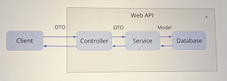

# Table of Contents
- [Model-View-Controller (MVC) pattern](#model-view-controller-mvc-pattern)
- [HTTP Request Methods](#http-request-methods)
- [Best Practice: Web API Structure](#best-practice-web-api-structure)
  - [Service Layer](#service-layer)
  - [Data Transfer Objects (DTOs)](#data-transfer-objects-dtos)

# Model-View-Controller (MVC) pattern
The Model-View-Controller (MVC) pattern is a way of organizing code in a software application that separates the data, user interface, and control logic into **three** interconnected components. This helps to make the code more modular, easier to maintain, and more straightforward to understand.

Imagine you're at a restaurant with a menu, a chef, and a waiter.

**Model**: The chef represents the Model. The chef is responsible for managing the ingredients and preparing the dishes. In the context of a software application, the Model represents the data and the business logic that manipulates that data. In a .NET Web API, this would include database access and any algorithms or rules specific to your application.

**View**: The menu represents the View. It's the way you, as a customer, interact with the restaurant's offerings. The View is the user interface that presents the data to the user and receives their inputs. In a .NET Web API, this might be an HTML, CSS, and JavaScript web page or a mobile app that displays the data and allows users to interact with it.

**Controller**: The waiter represents the Controller. The waiter takes your order, communicates it to the chef (Model), and brings the prepared dish back to you. The Controller manages the flow of data between the Model and the View. In a .NET Web API, this would involve receiving requests from the View, processing them, and returning the appropriate data or response.

So, in the restaurant scenario, you (the user) interact with the menu (View), place an order, and the waiter (Controller) takes the order to the chef (Model). The chef prepares the dish and gives it back to the waiter, who then serves it to you.

In the context of .NET Web API, a user might submit a request to update their profile information. The request is received by the Controller, which then communicates with the Model to update the data in the database. Once the data has been updated, the Controller sends a response back to the View, indicating whether the operation was successful or not.

By separating the concerns of data management (Model), user interface (View), and control logic (Controller), the MVC pattern makes it easier to develop, maintain, and understand complex software applications, such as those built using .NET Web API.

# HTTP Request Methods
In layman terms, HTTP request methods are like verbs that tell a server what action to perform on a specified resource. In the context of a .NET Web API, there are four key HTTP request methods: GET, POST, PUT, and DELETE. They allow clients, such as web browsers or mobile apps, to interact with the server in different ways.

GET: The GET method is used to request data from a server. It's like asking a librarian for a specific book. When you use the GET method, you're essentially saying, "Please give me the information about this resource." In a .NET Web API, the GET method retrieves data from the server without modifying it.
Example: A user wants to view their profile information on a website. The client sends an HTTP GET request to the server, which then retrieves the user's profile data and sends it back as a response.

POST: The POST method is used to submit data to a server to create a new resource. It's like filling out a form and submitting it to create a new account. When you use the POST method, you're saying, "Please create a new resource with this data." In a .NET Web API, the POST method adds new data to the server.
Example: A user wants to register for a new account on a website. The client sends an HTTP POST request to the server with the user's information. The server then creates a new account with the provided data and sends a response confirming the successful creation.

PUT: The PUT method is used to update an existing resource on the server with new data. It's like editing a document and saving the changes. When you use the PUT method, you're saying, "Please update this existing resource with this new data." In a .NET Web API, the PUT method modifies existing data on the server.
Example: A user wants to update their profile information on a website. The client sends an HTTP PUT request to the server with the updated information. The server then modifies the user's profile data and sends a response confirming the successful update.

DELETE: The DELETE method is used to remove a resource from the server. It's like throwing a document into a trash bin. When you use the DELETE method, you're saying, "Please delete this resource." In a .NET Web API, the DELETE method removes data from the server.
Example: A user wants to delete their account on a website. The client sends an HTTP DELETE request to the server. The server then removes the user's account and sends a response confirming the successful deletion.

In summary, the four key HTTP request methods in the context of a .NET Web API are like verbs that tell the server what action to perform on a resource: GET to retrieve data, POST to create new resources, PUT to update existing resources, and DELETE to remove resources. These methods allow clients to interact with the server in various ways, depending on the desired outcome.

# Best Practice: Web API Structure

## Service Layer
Imagine a .NET Web API project with a single controller called BooksController that currently handles all the logic for creating, retrieving, updating, and deleting books. As the project grows, it becomes harder to maintain the code, and it's not efficient to copy and paste the same code in other controllers if needed.

To improve the project's structure, we can separate the logic into different classes called services. In our case, we'll create a BookService class.

Now, the BooksController should only forward data to the BookService and return the result to the client. To inject the BookService into the controller, we'll use dependency injection. This way, if we change the implementation of the BookService, we don't need to modify every controller that uses it.

## Data Transfer Objects (DTOs)
Additionally, we'll introduce Data Transfer Objects (DTOs) for better communication between the client and server. In our case, we could have a Book model that represents a database table and a BookDTO that is used to communicate with the client. For example, if the Book model has a DateCreated field that we don't want to send to the client, we can exclude it from the BookDTO.

We can use a library like AutoMapper to map data between the Book model and the BookDTO easily. DTOs can be used for both sending and receiving data, allowing more flexibility in what is sent to or received from the client.



By implementing these changes, the project becomes more organized and easier to maintain, allowing for better separation of concerns and more efficient use of services and DTOs.

Here's an example to illustrate how to use DTOs in a .NET Web API:

1. Suppose you have a `Book` model class that represents a book in your application:

    ```csharp
    public class Book
    {
        public int Id { get; set; }
        public string Title { get; set; }
        public string Author { get; set; }
        public DateTime PublicationDate { get; set; }
        public bool IsDeleted { get; set; }
    }

2. You don't want to expose the `IsDeleted` property to the client. Instead, you create a `BookDTO` class that only includes the properties you want to share with the client:

    ```csharp
    public class BookDTO
    {
        public int Id { get; set; }
        public string Title { get; set; }
        public string Author { get; set; }
        public DateTime PublicationDate { get; set; }
    }
    ```
3. You can use a library like AutoMapper to map data between the `Book` model and the `BookDTO` easily:

    - Install the AutoMapper NuGet package:

        ```bash
        dotnet add package AutoMapper.Extensions.Microsoft.DependencyInjection
        ```

    - In the Startup.cs file, add the following line in the ConfigureServices method to configure AutoMapper
    
        ```csharp
        builder.Services.AddAutoMapper(typeof(Program).Assembly);
        ```

    - Create a mapping profile for the `Book` model and the `BookDTO` class:

        ```csharp
        public class MappingProfile : Profile
        {
            public MappingProfile()
            {
                CreateMap<Book, BookDTO>();
            }
        }
        ```

    - In the BookService, inject the IMapper interface and update the GetBooksAsync method to use AutoMapper:

        ```csharp
        public class BookService : IBookService
        {
            private readonly IMapper _mapper;

            public BookService(IMapper mapper)
            {
                _mapper = mapper;
            }

            public async Task<List<BookDTO>> GetBooksAsync()
            {
                // Simulate fetching books from a database.
                await Task.Delay(1000);

                var books = new List<Book>
                {
                    new Book { Id = 1, Title = "Book 1", Author = "Author 1", PublicationDate = DateTime.Now, IsDeleted = false },
                    new Book { Id = 2, Title = "Book 2", Author = "Author 2", PublicationDate = DateTime.Now, IsDeleted = false }
                };

                // Use AutoMapper to convert the list of Book objects to a list of BookDTO objects.
                var bookDTOs = _mapper.Map<List<BookDTO>>(books);

                return bookDTOs;
            }
        }
        ```

    - In the BooksController, inject the IBookService interface and update the GetBooksAsync method to use the BookService:

        ```csharp
        [ApiController]
        [Route("[controller]")]
        public class BooksController : ControllerBase
        {
            private readonly IBookService _bookService;

            public BooksController(IBookService bookService)
            {
                _bookService = bookService;
            }

            [HttpGet]
            public async Task<ActionResult<List<BookDTO>>> GetBooksAsync()
            {
                var books = await _bookService.GetBooksAsync();

                return Ok(books);
            }
        }
        ```
4. Now, when you send a GET request to the BooksController, the client receives a list of BookDTO objects without the IsDeleted property.

### Best practice: DTOs using record type instead of class
In C#, records were introduced as a new type in C# 9.0 to make it easier to create simple, immutable, and data-oriented objects. When compared to classes, records have several advantages for creating DTOs (Data Transfer Objects)

1. Conciseness: Records provide a concise syntax for defining simple data objects, reducing boilerplate code. With records, you can define a DTO in a single line of code.

2. Immutability: Records are immutable by default, making them safe to share between different parts of your application. This ensures that your DTOs cannot be accidentally modified and helps prevent bugs.

3. Value equality: Records provide value equality out of the box, which means that two records with the same values are considered equal, regardless of their reference. This makes it easier to compare DTOs and helps prevent errors when working with collections.
    
4. Pattern matching: Records are compatible with pattern matching, which is a powerful feature in C# that allows you to extract data from complex objects in a concise and readable way. This makes it easier to work with DTOs and extract the data you need.
    
5. Serialization: Records provide built-in support for serialization and deserialization, making it easy to convert your DTOs to and from JSON, XML, or other formats.

Overall, records provide a more concise, readable, and safe way to define simple DTOs in C#. While classes can also be used to define DTOs, records provide several advantages that make them a better choice in most cases.

Example:

```csharp
    public record BookDTO
    {
        public int Id { get; init; }
        public string Title { get; init; }
        public string Author { get; init; }
        public DateTime PublicationDate { get; init; }
    }
```

# Dependency Injection
Dependency injection is a software design pattern that allows us to implement loosely coupled code. In other words, it allows us to write code that is loosely coupled to other components, making it easier to maintain and test. Dependency injection allows us to inject services into controllers, repositories, and other classes. This way, we can easily swap out the implementation of a service without having to modify the code that uses it.

## Constructor Injection
 constructor injection is a technique used to provide a class with its dependencies, like services, through its constructor. It's a way of telling a class, "Hey, here's everything you need to do your job!" This approach helps keep your code organized, maintainable, and testable.

In the context of a .NET Web API project, you often have controllers that depend on services to handle the business logic. Instead of creating these service instances directly within the controller, you can "inject" them through the controller's constructor. This way, the controller doesn't need to know how to create the service – it just receives a ready-to-use instance.

Constructor injection relies on an Inversion of Control (IoC) container, which manages the creation and lifetime of objects for you. In .NET, the built-in dependency injection system handles this role.

Let's consider an example using a `BooksController` and a `BookService`:

1. First, define an interface for the `BookService`:
  
      ```csharp
      public interface IBookService
      {
          IEnumerable<Book> GetBooks();
          // Other methods for handling books
      }
      ```
2. Implements the `BookService`:

      ```csharp
      public class BookService : IBookService
      {
          public IEnumerable<Book> GetBooks()
          {
              // Implementation for getting books from a database, for example.
          }
          // Implement other methods for handling books
      }
      ```
3. In the `BooksController`, inject the `IBookService` through the constructor:

      ```csharp
      [ApiController]
      [Route("api/[controller]")]
      public class BooksController : ControllerBase
      {
          private readonly IBookService _bookService;

          public BooksController(IBookService bookService)
          {
              _bookService = bookService;
          }

          [HttpGet]
          public IActionResult GetAllBooks()
          {
              var books = _bookService.GetBooks();
              return Ok(books);
          }

          // Other action methods (POST, PUT, DELETE) would follow the same pattern.
      }
      ```
4. Register the service in the IoC container (usually in the Startup.cs file):

      ```csharp
        services.AddScoped<IBookService, BookService>();
      ```
In this example, the `BooksController` receives an instance of `IBookService` through its constructor. The .NET dependency injection system takes care of creating the `BookService` instance and provides it to the controller.

Constructor injection helps you adhere to the Dependency Inversion Principle, which states that high-level modules should not depend on low-level modules, but both should depend on abstractions (in this case, the `IBookService` interface). This makes your code more flexible, maintainable, and easier to test.

## Service lifetime methods
`services.AddScoped`, `services.AddTransient`, and `services.AddSingleton` are methods used to register services with different lifetimes in a .NET Web API project. These methods tell the dependency injection system how long a service instance should live and how it should be shared among different consumers.

These methods help you control the lifetime of your services according to the specific needs of your .NET Web API project. It's essential to choose the appropriate method based on the service's nature, whether it needs to maintain state, and how it interacts with other components in your application.

| Method              | Explanation                                                                                                                                                                                                                                       | Example                                                                                                          | Use Case                                                                                                                                             |
|---------------------|---------------------------------------------------------------------------------------------------------------------------------------------------------------------------------------------------------------------------------------------------|------------------------------------------------------------------------------------------------------------------|-------------------------------------------------------------------------------------------------------------------------------------------------------|
| `services.AddScoped` | Creates a new instance of the service per request (per HTTP request in Web API). Each request gets its own instance, but the instance is shared among all components within the same request.                                                       | Register a `BookService` that retrieves data from a database and needs to be request-specific: `services.AddScoped<IBookService, BookService>();` | Use when the service needs to maintain a state per request or when working with resources like database connections that should not be shared across different requests. |
| `services.AddTransient` | Creates a new instance of the service every time it is requested. Each consumer gets its own instance, and there's no sharing of instances between consumers.                                                                                    | Register a `LoggingService` that doesn't need to maintain any state: `services.AddTransient<ILoggingService, LoggingService>();`               | Use when the service is lightweight, stateless, and doesn't need to be shared among different consumers within a request.                                        |
| `services.AddSingleton` | Creates a single instance of the service when the application starts, and that instance is shared among all consumers throughout the application's lifetime. The same instance is reused for all requests and consumers.                              | Register a `ConfigurationService` that reads configuration data once and caches it: `services.AddSingleton<IConfigurationService, ConfigurationService>();` | Use when the service is expensive to create, doesn't need to maintain a per-request state, and can be safely shared among different consumers and requests.   |

# Asynchronous Calls
Asynchronous calls are a way to execute tasks without waiting for them to finish before moving on to the next task. It's like having multiple chefs working in a kitchen instead of just one - they can all work on different dishes simultaneously without waiting for one dish to be completed before starting the next one. This approach helps improve the responsiveness and efficiency of your application.

In the context of a .NET Web API, asynchronous calls are used to handle HTTP requests without blocking the server from processing other incoming requests. When a client sends a request to the server, it doesn't have to wait for the server to finish processing the request before it can handle other requests. This can be particularly helpful when your server needs to perform time-consuming tasks like querying a database, making network calls, or processing large amounts of data.

To implement asynchronous calls in .NET Web API, you can use the `async` and `await` keywords along with the `Task` class. Here's an example:

1. In the `BookService`, create an asynchronous method to fetch books from a database:

      ```csharp
      public async Task<IEnumerable<Book>> GetBooksAsync()
      {
          // Simulate a time-consuming task like querying a database.
          await Task.Delay(1000);
          return new List<Book>
          {
              new Book { Id = 1, Title = "Book 1", Author = "Author 1" },
              new Book { Id = 2, Title = "Book 2", Author = "Author 2" }
          };
      }
      ```
2. In the `BooksController`, create an asynchronous action method to fetch books using the asynchronous service method:

      ```csharp
      [ApiController]
      [Route("api/[controller]")]
      public class BooksController : ControllerBase
      {
          private readonly IBookService _bookService;

          public BooksController(IBookService bookService)
          {
              _bookService = bookService;
          }

          [HttpGet]
          public async Task<IActionResult> GetAllBooksAsync()
          {
              var books = await _bookService.GetBooksAsync();
              return Ok(books);
          }

          // Other action methods (POST, PUT, DELETE) would follow the same pattern.
      }
      ```
In this example, the `GetBooksAsync` method in the `BookService` simulates a time-consuming task using `await Task.Delay(1000)`. The `BooksController` then calls this method using the `await` keyword. This allows the server to handle other incoming requests while it waits for the time-consuming task to finish, improving the application's overall performance.

By using asynchronous calls in your .NET Web API, you can create more efficient and responsive applications that can handle multiple requests simultaneously without blocking.

# Proper Service Response with Generics
A proper service response with generics is a way to create a standard and reusable structure for the responses returned by your services in a .NET Web API project. It helps you to consistently handle various outcomes, such as success, failure, and validation errors, while providing meaningful information to the client.

Using generics in the context of a service response allows you to define a single response class that can handle different data types, making it more flexible and maintainable. The response class can include properties like status, message, and data, which can be of any type specified by the generic parameter.

Here's an example to illustrate how to create a proper service response with generics:

1. Define a generic `ServiceResponse` class:

    ```csharp
    public class ServiceResponse<T>
    {
        public bool Success { get; set; } = true;
        public string Message { get; set; } = null;
        public T Data { get; set; }
    }
    ```
2. In the `BookService`, create a method that returns a `ServiceResponse` with a list of books:

    ```csharp
    public async Task<ServiceResponse<List<Book>>> GetBooksAsync()
    {
        // Simulate a time-consuming task like querying a database.
        await Task.Delay(1000);

        var books = new List<Book>
        {
            new Book { Id = 1, Title = "Book 1", Author = "Author 1" },
            new Book { Id = 2, Title = "Book 2", Author = "Author 2" }
        };

        return new ServiceResponse<List<Book>>
        {
            Data = books,
            Success = true,
            Message = "Books retrieved successfully"
        };
    }
    ```

3. In the `BooksController`, create an action method that uses the `ServiceResponse` from the `BookService`:

    ```csharp
    [ApiController]
    [Route("api/[controller]")]
    public class BooksController : ControllerBase
    {
        private readonly IBookService _bookService;

        public BooksController(IBookService bookService)
        {
            _bookService = bookService;
        }

        [HttpGet]
        public async Task<IActionResult> GetAllBooksAsync()
        {
            var response = await _bookService.GetBooksAsync();
            if (response.Success)
            {
                return Ok(response);
            }

            return BadRequest(response);
        }

        // Other action methods (POST, PUT, DELETE) would follow the same pattern.
    }
    ```

In this example, the `ServiceResponse` class is a generic class that can handle various data types, allowing you to use it for different types of responses in your application. The `BookService` returns a `ServiceResponse` with a list of books, and the `BooksController` checks the `Success` property to determine whether the response is successful before returning the result to the client.

By using a proper service response with generics in your .NET Web API, you can create a consistent and reusable structure for handling different outcomes and providing meaningful information to the clients.